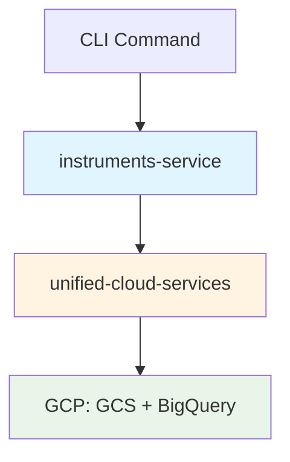

# Command Flow Diagram

## Visual Flow: Instruments Generation Command

```
python -m instruments_service --mode instruments --start-date 2023-05-23 --end-date 2023-05-24
```

---

## Level 1: High-Level Architecture



---

## Level 2: Component Interaction

```
┌─────────────────────────────────────────────────────────────────────────┐
│                          COMMAND LINE                                   │
│  python -m instruments_service --mode instruments --start-date ...      │
└─────────────────────────────────────────────┬───────────────────────────┘
                                              │
                                              ▼
┌─────────────────────────────────────────────────────────────────────────┐
│                        instruments-service                               │
│                                                                          │
│  ┌────────────────────────────────────────────────────────────────┐    │
│  │  1. CLI Entry (__main__.py)                                     │    │
│  │     └─▶ Load .env                                               │    │
│  │     └─▶ Call run_cli()                                          │    │
│  └────────────────────────────────────────────────────────────────┘    │
│                                  │                                       │
│                                  ▼                                       │
│  ┌────────────────────────────────────────────────────────────────┐    │
│  │  2. Main Orchestration (cli/main.py)                            │    │
│  │     ├─▶ Parse arguments (parser.py)                             │    │
│  │     ├─▶ Patch unified-cloud-services config ⚠️                 │    │
│  │     ├─▶ Get handler for mode                                    │    │
│  │     └─▶ Execute handler.run()                                   │    │
│  └────────────────────────────────────────────────────────────────┘    │
│                                  │                                       │
│                                  ▼                                       │
│  ┌────────────────────────────────────────────────────────────────┐    │
│  │  3. Instrument Handler (handlers/instrument_handler.py)         │    │
│  │     ├─▶ Parse date range                                        │    │
│  │     ├─▶ Determine market types (CEFI/TRADFI/DEFI)              │    │
│  │     └─▶ For each date:                                          │    │
│  │         ├─▶ Check if exists (skip if not --force)              │    │
│  │         └─▶ Call InstrumentsService.generate_instruments()     │    │
│  └────────────────────────────────────────────────────────────────┘    │
│                                  │                                       │
│                                  ▼                                       │
│  ┌────────────────────────────────────────────────────────────────┐    │
│  │  4. Instruments Service (core/instruments_service.py)           │    │
│  │     ├─▶ Validate venue filters                                  │    │
│  │     ├─▶ Process CEFI (parallel)                                 │    │
│  │     │   └─▶ Fetch from Tardis API + CCXT enrichment            │    │
│  │     ├─▶ Process TRADFI (parallel)                               │    │
│  │     │   └─▶ Fetch from Databento API + VIX definition          │    │
│  │     ├─▶ Process DEFI                                            │    │
│  │     │   └─▶ Fetch from The Graph + Direct APIs                 │    │
│  │     ├─▶ Consolidate all instruments                             │    │
│  │     └─▶ Store to cloud                                          │    │
│  └────────────────────────────────────────────────────────────────┘    │
│                                  │                                       │
│                                  ▼                                       │
│  ┌────────────────────────────────────────────────────────────────┐    │
│  │  5. Cloud Storage (core/cloud_instrument_storage.py)            │    │
│  │     ├─▶ Determine market category per instrument                │    │
│  │     ├─▶ Split by category (CEFI/TRADFI/DEFI)                   │    │
│  │     └─▶ For each category:                                      │    │
│  │         ├─▶ Get category-specific bucket                        │    │
│  │         ├─▶ Create CloudTarget                                  │    │
│  │         └─▶ Call StandardizedDomainCloudService                 │    │
│  └────────────────────────────────────────────────────────────────┘    │
│                                  │                                       │
└──────────────────────────────────┼───────────────────────────────────────┘
                                   │
                                   ▼
┌─────────────────────────────────────────────────────────────────────────┐
│                      unified-cloud-services                              │
│                                                                          │
│  ┌────────────────────────────────────────────────────────────────┐    │
│  │  6. Standardized Service (domain/standardized_service.py)       │    │
│  │     ├─▶ Apply domain validation (schema checks)                 │    │
│  │     ├─▶ Wrap async operations in sync API                       │    │
│  │     └─▶ Delegate to UnifiedCloudService                         │    │
│  └────────────────────────────────────────────────────────────────┘    │
│                                  │                                       │
│                                  ▼                                       │
│  ┌────────────────────────────────────────────────────────────────┐    │
│  │  7. Unified Cloud Service (core/unified_cloud_service.py)       │    │
│  │     ├─▶ Connection pooling (GCS + BigQuery clients)             │    │
│  │     ├─▶ Concurrent upload optimization                           │    │
│  │     ├─▶ upload_to_gcs() - async operation                       │    │
│  │     └─▶ upload_to_bigquery() - async operation                  │    │
│  └────────────────────────────────────────────────────────────────┘    │
│                                  │                                       │
└──────────────────────────────────┼───────────────────────────────────────┘
                                   │
                                   ▼
┌─────────────────────────────────────────────────────────────────────────┐
│                              Google Cloud Platform                       │
│                                                                          │
│  ┌────────────────────────┐         ┌────────────────────────┐         │
│  │   GCS Storage          │         │   BigQuery             │         │
│  │                        │         │                        │         │
│  │  • CEFI bucket         │         │  • instruments dataset │         │
│  │  • TRADFI bucket       │         │  • Daily partitions    │         │
│  │  • DEFI bucket         │         │  • Clustered tables    │         │
│  └────────────────────────┘         └────────────────────────┘         │
│                                                                          │
└─────────────────────────────────────────────────────────────────────────┘
```

---

## Level 3: Detailed Flow with Code References

```
┌─────────────────────────────────────────────────────────────────────────┐
│ 1. CLI ENTRY POINT                                                       │
│    File: instruments_service/__main__.py                                 │
└─────────────────────────────────────────────────────────────────────────┘
         │
         │  python -m instruments_service [args]
         │
         ▼
┌─────────────────────────────────────────────────────────────────────────┐
│ 2. MAIN ORCHESTRATION                                                    │
│    File: instruments_service/cli/main.py                                 │
│                                                                          │
│    _load_env_early()                     # Lines 18-32                  │
│      └─▶ Load .env file                                                 │
│                                                                          │
│    Patch unified-cloud-services          # Lines 42-52 ⚠️ CRITICAL     │
│      └─▶ unified_cloud_services.core.market_category.unified_config     │
│          = instruments_config                                           │
│                                                                          │
│    main()                                # Lines 63-209                 │
│      ├─▶ args = parse_arguments()        # Line 72                     │
│      ├─▶ handler = get_handler_for_mode(args.mode, config) # Line 89  │
│      └─▶ result = handler.run(**kwargs)  # Line 149                    │
└─────────────────────────────────────────────────────────────────────────┘
         │
         ├──────────────────────────────────────────────────────────┐
         │                                                           │
         ▼                                                           ▼
┌────────────────────────┐                    ┌─────────────────────────┐
│ 2a. PARSER             │                    │ 2b. HANDLER SELECTION   │
│ File: cli/parser.py    │                    │ File: cli/handlers/     │
│                        │                    │       __init__.py       │
│ parse_arguments()      │                    │                         │
│   ├─▶ --mode           │                    │ get_handler_for_mode()  │
│   ├─▶ --start-date     │                    │   "instruments"         │
│   ├─▶ --end-date       │                    │     └─▶ InstrumentHandler│
│   ├─▶ --force          │                    │   "instruments-query"   │
│   ├─▶ --CEFI           │                    │     └─▶ QueryHandler    │
│   ├─▶ --TRADFI         │                    │                         │
│   └─▶ --DEFI           │                    │                         │
└────────────────────────┘                    └─────────────────────────┘
                                                         │
                                                         ▼
┌─────────────────────────────────────────────────────────────────────────┐
│ 3. INSTRUMENT HANDLER                                                    │
│    File: handlers/instrument_handler.py                                  │
│                                                                          │
│    __init__()                            # Lines 55-78                  │
│      ├─▶ instruments_service = InstrumentsService(config)              │
│      ├─▶ cloud_storage = CloudInstrumentStorage()                      │
│      └─▶ venue_mapping = VenueMapping()                                │
│                                                                          │
│    run(start_date, end_date, force, **kwargs)  # Line 80              │
│      └─▶ _execute_instrument_generation()      # Line 84              │
│                                                                          │
│    _execute_instrument_generation()      # Lines 84-253                │
│      ├─▶ Parse dates                     # Lines 87-90                 │
│      ├─▶ Generate date range             # Line 93                     │
│      ├─▶ Determine market types          # Lines 105-127               │
│      │   (default: ALL if no flags)                                    │
│      │                                                                  │
│      └─▶ FOR EACH DATE:                  # Lines 135-218               │
│          ├─▶ Check if exists (GCS)       # Lines 146-158               │
│          │   (skip if not --force)                                     │
│          │                                                              │
│          ├─▶ Generate instruments        # Lines 163-174               │
│          │   asyncio.run(                                              │
│          │     instruments_service.generate_instruments_for_date()    │
│          │   )                                                          │
│          │                                                              │
│          └─▶ Track metrics               # Lines 177-211               │
│              ├─▶ total_generated                                        │
│              ├─▶ total_processing_errors                               │
│              └─▶ total_processing_warnings                             │
└─────────────────────────────────────────────────────────────────────────┘
         │
         ▼
┌─────────────────────────────────────────────────────────────────────────┐
│ 4. INSTRUMENTS SERVICE (Orchestration Layer)                             │
│    File: app/core/instruments_service.py                                 │
│                                                                          │
│    generate_instruments_for_date()       # Lines 90-702                │
│      │                                                                   │
│      ├─▶ Validate venue filters          # Lines 180-266               │
│      │   └─▶ Reject invalid venues with clear error                    │
│      │                                                                   │
│      ├─▶ Process CEFI (if cefi=True)     # Lines 270-368               │
│      │   ├─▶ exchanges = all_tardis_exchanges                          │
│      │   │   ['binance', 'deribit', 'bybit', 'okx', ...]              │
│      │   │                                                              │
│      │   └─▶ PARALLEL PROCESSING:                                      │
│      │       async def process_single_exchange(exchange):              │
│      │         └─▶ processing_service.process_exchange_instruments()   │
│      │             ├─▶ Fetch from Tardis API                           │
│      │             ├─▶ Enrich with CCXT                                │
│      │             └─▶ Generate canonical keys                         │
│      │                                                                  │
│      │       results = await asyncio.gather(                           │
│      │         *[process_single_exchange(ex) for ex in exchanges]     │
│      │       )                                                          │
│      │                                                                  │
│      ├─▶ Process TRADFI (if tradfi=True) # Lines 370-468               │
│      │   ├─▶ databento_exchanges = ["CME", "CBOE"]                    │
│      │   │                                                              │
│      │   └─▶ PARALLEL PROCESSING:                                      │
│      │       async def process_databento_exchange(exchange):           │
│      │         if exchange == "CBOE":                                  │
│      │           └─▶ Create VIX instrument definition                  │
│      │         else:                                                   │
│      │           └─▶ fetch_databento_instruments()                    │
│      │               ├─▶ Fetch from Databento API                      │
│      │               └─▶ Generate canonical keys                       │
│      │                                                                  │
│      │       results = await asyncio.gather(                           │
│      │         *[process_databento_exchange(ex) for ex in exchanges]  │
│      │       )                                                          │
│      │                                                                  │
│      ├─▶ Process DEFI (if defi=True)     # Lines 469-576               │
│      │   ├─▶ defi_protocols = [                                        │
│      │   │     ("uniswap_v3", "ETHEREUM"),                             │
│      │   │     ("curve", "ETHEREUM"),                                  │
│      │   │     ("hyperliquid", None),                                  │
│      │   │     ...                                                     │
│      │   │   ]                                                         │
│      │   │                                                              │
│      │   └─▶ FOR EACH PROTOCOL:                                        │
│      │       └─▶ fetch_defi_instruments(protocol, chain, date)        │
│      │           ├─▶ Fetch from The Graph API                          │
│      │           ├─▶ Fetch from direct APIs (Hyperliquid, Aster)     │
│      │           └─▶ Generate canonical keys                           │
│      │                                                                  │
│      ├─▶ Consolidate Results              # Lines 637-645               │
│      │   ├─▶ Convert to DataFrame                                      │
│      │   └─▶ instruments_df = pd.DataFrame(instruments_list)          │
│      │                                                                  │
│      └─▶ Store to Cloud                   # Lines 648-682               │
│          └─▶ cloud_storage.store_instruments(                          │
│                instruments_df=instruments_df,                           │
│                table_name="instruments",                                │
│                date=date                                                │
│              )                                                           │
└─────────────────────────────────────────────────────────────────────────┘
         │
         ▼
┌─────────────────────────────────────────────────────────────────────────┐
│ 5. CLOUD INSTRUMENT STORAGE (Bridge to unified-cloud-services)          │
│    File: app/core/cloud_instrument_storage.py                           │
│                                                                          │
│    __init__()                            # Lines 50-100                 │
│      ├─▶ Import unified-cloud-services                                 │
│      ├─▶ Detect test environment                                       │
│      ├─▶ Create CloudTarget                                            │
│      └─▶ Create StandardizedDomainCloudService                         │
│                                                                          │
│    store_instruments()                   # Lines 103-340                │
│      │                                                                   │
│      ├─▶ Determine Market Category       # Lines 118-142               │
│      │   └─▶ from unified_cloud_services import (                     │
│      │         determine_market_category,                              │
│      │         get_bucket_for_category,                                │
│      │       )                                                          │
│      │                                                                  │
│      │   └─▶ instruments_df["market_category"] = instruments_df.apply(│
│      │         lambda row: determine_market_category(                  │
│      │           venue=row["venue"],                                   │
│      │           instrument_type=row["instrument_type"],               │
│      │         ),                                                       │
│      │         axis=1                                                   │
│      │       )                                                          │
│      │                                                                  │
│      └─▶ FOR EACH CATEGORY:              # Lines 144-238               │
│          │                                                              │
│          ├─▶ Filter by category                                        │
│          │   category_df = instruments_df[                             │
│          │     instruments_df["market_category"] == category           │
│          │   ]                                                          │
│          │                                                              │
│          ├─▶ Get category-specific bucket                              │
│          │   category_bucket = get_bucket_for_category(category)      │
│          │   # CEFI → "instruments-store-cefi"                         │
│          │   # TRADFI → "instruments-store-tradfi"                     │
│          │   # DEFI → "instruments-store-defi"                         │
│          │                                                              │
│          ├─▶ Create category CloudTarget                               │
│          │   category_target = CloudTarget(                            │
│          │     gcs_bucket=category_bucket,                             │
│          │     ...                                                      │
│          │   )                                                          │
│          │                                                              │
│          ├─▶ Upload to GCS                                             │
│          │   gcs_path = f"instrument_availability/by_date/             │
│          │                day-{date_str}/instruments.parquet"          │
│          │                                                              │
│          │   self.cloud_service.upload_to_gcs(                         │
│          │     data=category_df,                                       │
│          │     gcs_path=gcs_path,                                      │
│          │     format="parquet",                                       │
│          │     metadata={                                              │
│          │       "date": date_str,                                     │
│          │       "category": category,                                 │
│          │       "instrument_count": len(category_df),                 │
│          │     }                                                        │
│          │   )                                                          │
│          │                                                              │
│          └─▶ Upload to BigQuery                                        │
│              self.cloud_service.upload_to_bigquery(                    │
│                data=category_df,                                       │
│                table_name="instruments",                               │
│                write_mode="safe",  # Delete existing + Insert          │
│                partition_field="timestamp",                            │
│              )                                                          │
└─────────────────────────────────────────────────────────────────────────┘
         │
         ▼
┌─────────────────────────────────────────────────────────────────────────┐
│                      unified-cloud-services                              │
└─────────────────────────────────────────────────────────────────────────┘
         │
         ▼
┌─────────────────────────────────────────────────────────────────────────┐
│ 6. STANDARDIZED DOMAIN CLOUD SERVICE                                     │
│    File: domain/standardized_service.py                                  │
│                                                                          │
│    __init__(domain, cloud_target)        # Lines 87-129                │
│      ├─▶ self.domain = "instruments"                                   │
│      ├─▶ self.cloud_target = cloud_target                              │
│      ├─▶ Create UnifiedCloudService                                    │
│      └─▶ Create DomainValidationService                                │
│                                                                          │
│    upload_to_gcs()                       # Lines 198-229                │
│      ├─▶ Synchronous wrapper                                           │
│      │                                                                   │
│      └─▶ async def _upload():                                          │
│            return await self.unified_service.upload_to_gcs(            │
│              target=self.cloud_target,  # Category-specific bucket     │
│              data=data,                                                 │
│              gcs_path=gcs_path,                                         │
│              format=format,                                             │
│              metadata=metadata,                                         │
│            )                                                            │
│                                                                          │
│          return self._run_async(_upload())  # Event loop management    │
│                                                                          │
│    upload_to_bigquery()                  # Lines 254-320                │
│      ├─▶ Apply domain validation         # Lines 281-287               │
│      │   validation_result = self.domain_validation.validate_dataframe(│
│      │     data                                                         │
│      │   )                                                              │
│      │   if not validation_result.is_valid:                            │
│      │     raise ValueError(validation_result.errors)                  │
│      │                                                                   │
│      └─▶ async def _upload():                                          │
│            return await self.unified_service.upload_to_bigquery(       │
│              target=self.cloud_target,                                 │
│              data=data,                                                 │
│              table_name=table_name,                                     │
│              write_mode=write_mode,                                     │
│              partition_field=partition_field,                           │
│              clustering_fields=clustering_fields,                       │
│            )                                                            │
│                                                                          │
│          return self._run_async(_upload())                             │
└─────────────────────────────────────────────────────────────────────────┘
         │
         ▼
┌─────────────────────────────────────────────────────────────────────────┐
│ 7. UNIFIED CLOUD SERVICE (Core async operations)                        │
│    File: core/unified_cloud_service.py                                   │
│                                                                          │
│    upload_to_gcs()                       # Lines 201-290                │
│      │                                                                   │
│      └─▶ async with self._upload_semaphore:  # Concurrency control    │
│          │                                                              │
│          ├─▶ Get GCS client (pooled)                                   │
│          │   gcs_client = self._get_gcs_client()                       │
│          │   bucket = gcs_client.bucket(target.gcs_bucket)             │
│          │   blob = bucket.blob(gcs_path)                              │
│          │                                                              │
│          ├─▶ Set metadata                                              │
│          │   if metadata:                                              │
│          │     blob.metadata = metadata                                │
│          │                                                              │
│          ├─▶ Handle DataFrame → Parquet                                │
│          │   with tempfile.NamedTemporaryFile() as tmp_file:          │
│          │     data.to_parquet(                                        │
│          │       tmp_file.name,                                        │
│          │       engine="pyarrow",                                     │
│          │       compression="snappy",                                 │
│          │     )                                                        │
│          │     blob.upload_from_filename(tmp_file.name)               │
│          │                                                              │
│          └─▶ return f"gs://{target.gcs_bucket}/{gcs_path}"            │
│                                                                          │
│    upload_to_bigquery()                  # Lines 334-500                │
│      │                                                                   │
│      ├─▶ Prepare DataFrame                                             │
│      │   data = prepare_dataframe_for_bigquery(data)                  │
│      │   # Convert timestamps, sanitize columns, etc.                  │
│      │                                                                   │
│      ├─▶ Get BigQuery client (pooled)                                  │
│      │   bq_client = self._get_bigquery_client()                       │
│      │                                                                   │
│      ├─▶ Build table ID                                                │
│      │   table_id = f"{target.project_id}.                             │
│      │                {target.bigquery_dataset}.                        │
│      │                {table_name}"                                     │
│      │                                                                   │
│      ├─▶ Handle write mode                                             │
│      │   if write_mode == "safe":                                      │
│      │     # DELETE existing rows for this date                        │
│      │     delete_query = f"""                                         │
│      │       DELETE FROM `{table_id}`                                  │
│      │       WHERE DATE({partition_field}) = '{date}'                  │
│      │     """                                                          │
│      │     bq_client.query(delete_query).result()                      │
│      │                                                                   │
│      ├─▶ Configure table partitioning                                  │
│      │   job_config = bigquery.LoadJobConfig(                          │
│      │     write_disposition="WRITE_APPEND",                           │
│      │     time_partitioning=bigquery.TimePartitioning(               │
│      │       type_=bigquery.TimePartitioningType.DAY,                 │
│      │       field=partition_field,                                    │
│      │     ),                                                           │
│      │     clustering_fields=clustering_fields,                        │
│      │   )                                                              │
│      │                                                                   │
│      ├─▶ Upload DataFrame                                              │
│      │   job = bq_client.load_table_from_dataframe(                   │
│      │     data, table_id, job_config=job_config                       │
│      │   )                                                              │
│      │   job.result()  # Wait for completion                           │
│      │                                                                   │
│      └─▶ return {                                                       │
│            "status": "success",                                         │
│            "table_id": table_id,                                        │
│            "rows_uploaded": len(data),                                  │
│          }                                                              │
└─────────────────────────────────────────────────────────────────────────┘
         │
         ▼
┌─────────────────────────────────────────────────────────────────────────┐
│ 8. GOOGLE CLOUD PLATFORM                                                 │
│                                                                          │
│  ┌──────────────────────────────────────────────────────────────┐     │
│  │  GCS Storage                                                  │     │
│  │                                                               │     │
│  │  gs://instruments-store-cefi/                                │     │
│  │    instrument_availability/by_date/day-2023-05-23/           │     │
│  │      └─▶ instruments.parquet                                 │     │
│  │                                                               │     │
│  │  gs://instruments-store-tradfi/                              │     │
│  │    instrument_availability/by_date/day-2023-05-23/           │     │
│  │      └─▶ instruments.parquet                                 │     │
│  │                                                               │     │
│  │  gs://instruments-store-defi/                                │     │
│  │    instrument_availability/by_date/day-2023-05-23/           │     │
│  │      └─▶ instruments.parquet                                 │     │
│  └──────────────────────────────────────────────────────────────┘     │
│                                                                          │
│  ┌──────────────────────────────────────────────────────────────┐     │
│  │  BigQuery                                                     │     │
│  │                                                               │     │
│  │  central-element-323112.instruments.instruments               │     │
│  │    ├─▶ Partitioned by timestamp (DAILY)                      │     │
│  │    ├─▶ Clustered by venue, instrument_type                   │     │
│  │    └─▶ Rows: [instrument_key, venue, instrument_type, ...]   │     │
│  └──────────────────────────────────────────────────────────────┘     │
└─────────────────────────────────────────────────────────────────────────┘
```

---

## Data Flow Example: Single BTC-USDT Perpetual

```
1. FETCH FROM API
   ├─▶ Tardis API: binance-futures exchange
   │   └─▶ symbol: "BTCUSDT", type: "perpetual"
   │
   ├─▶ CCXT Enrichment: binance
   │   └─▶ lot_size: 0.001, tick_size: 0.1, leverage: 125

2. GENERATE CANONICAL KEY
   └─▶ InstrumentDefinition(
         instrument_key="BINANCE-FUTURES:PERPETUAL:BTC-USDT@LIN",
         venue="BINANCE-FUTURES",
         instrument_type="PERPETUAL",
         base_currency="BTC",
         quote_currency="USDT",
         contract_type="LINEAR",
         ...
       )

3. CLASSIFY MARKET CATEGORY
   └─▶ determine_market_category(
         venue="BINANCE-FUTURES",
         instrument_type="PERPETUAL"
       )
       └─▶ Returns: "CEFI"

4. GET CATEGORY BUCKET
   └─▶ get_bucket_for_category("CEFI")
       └─▶ Returns: "instruments-store-cefi"

5. UPLOAD TO GCS
   └─▶ gs://instruments-store-cefi/
       instrument_availability/by_date/day-2023-05-23/
       instruments.parquet

       Row: {
         instrument_key: "BINANCE-FUTURES:PERPETUAL:BTC-USDT@LIN",
         venue: "BINANCE-FUTURES",
         instrument_type: "PERPETUAL",
         base_currency: "BTC",
         quote_currency: "USDT",
         market_category: "CEFI",
         timestamp: "2023-05-23T00:00:00Z",
         ...
       }

6. UPLOAD TO BIGQUERY
   └─▶ central-element-323112.instruments.instruments
       Partition: DATE(timestamp) = '2023-05-23'

       Same row as GCS
```

---

## Critical Integration Points

### 1. Configuration Patching

```python
# File: instruments_service/cli/main.py (Lines 42-52)

import unified_cloud_services.core.market_category
unified_cloud_services.core.market_category.unified_config = instruments_config
```

**Why**: Ensures `unified-cloud-services` uses the correct bucket configuration from `instruments-service`.

---

### 2. Market Category Classification

```python
# File: instruments_service/app/core/cloud_instrument_storage.py

from unified_cloud_services import (
    determine_market_category,
    get_bucket_for_category,
)

# Classify each instrument
instruments_df["market_category"] = instruments_df.apply(
    lambda row: determine_market_category(
        venue=row["venue"],
        instrument_type=row["instrument_type"],
    ),
    axis=1
)

# Route to category-specific bucket
for category in categories:
    category_bucket = get_bucket_for_category(category)
    # Upload to category_bucket
```

**Why**: Enables independent batch processing per market category (CEFI/TRADFI/DEFI).

---

### 3. CloudTarget Configuration

```python
# Category-specific CloudTarget
category_target = CloudTarget(
    project_id="central-element-323112",
    gcs_bucket="instruments-store-cefi",  # Category-specific
    bigquery_dataset="instruments",
    bigquery_location="asia-northeast1",
)
```

**Why**: Each upload operation can target a different bucket based on category.

---

## Performance Optimizations

### 1. Parallel Exchange Processing

```python
# Process all CEFI exchanges in parallel
results = await asyncio.gather(
    *[process_single_exchange(ex) for ex in exchanges]
)
```

**Benefit**: Reduces total time from ~30 minutes (sequential) to ~5 minutes (parallel).

---

### 2. Connection Pooling

```python
# unified-cloud-services reuses clients
gcs_client = self._get_gcs_client()  # Cached
bq_client = self._get_bigquery_client()  # Cached
```

**Benefit**: Avoids authentication overhead on every operation.

---

### 3. Concurrency Control

```python
# Limit concurrent uploads
async with self._upload_semaphore:
    await blob.upload_from_filename(tmp_file.name)
```

**Benefit**: Prevents rate limit errors from GCS.

---

## Summary

The command flows through 8 levels:

1. **CLI Entry** → Parse command
2. **Main Orchestration** → Patch config, get handler
3. **Instrument Handler** → Date loop, check existence
4. **Instruments Service** → CEFI/TRADFI/DEFI orchestration
5. **Cloud Storage** → Category classification & routing
6. **Standardized Service** → Domain validation & sync wrapper
7. **Unified Service** → Async GCS/BQ operations
8. **GCP** → Final storage in GCS & BigQuery

**Key Integration**:

- `instruments-service` handles domain logic
- `unified-cloud-services` handles cloud operations
- Configuration patching ensures correct bucket routing
- Market category classification enables independent processing
